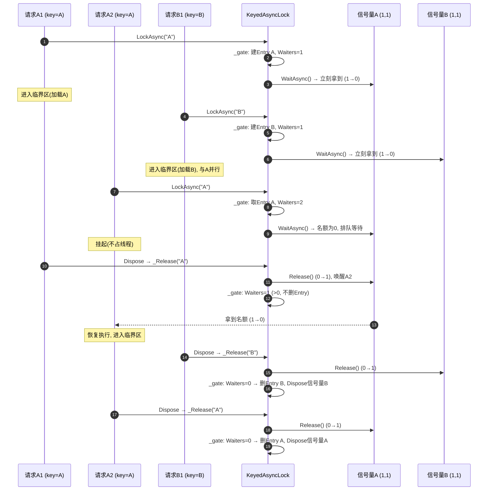
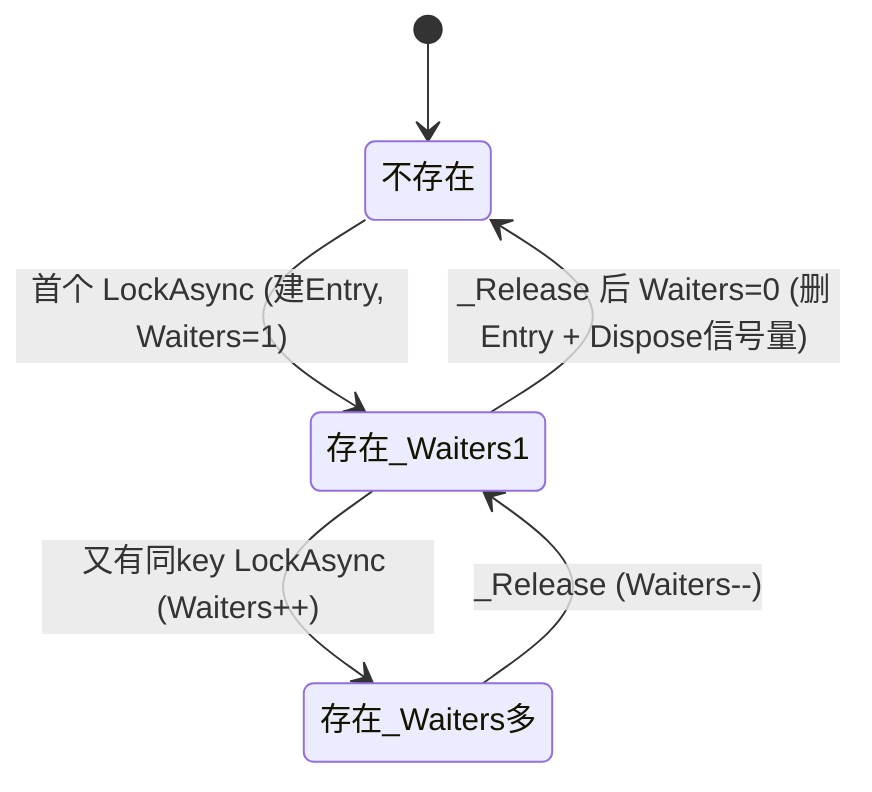

# 信号量与 KeyedAsyncLock 原理

## 1. 信号量(Semaphore)是什么

信号量本质是**一个计数器 + 一个等待队列**。计数器代表「还有多少个可用名额(permit)」,只有两个操作:

- **Wait / 获取**:计数器 > 0 时减 1 并放行;为 0 时排队等待,直到有人归还。
- **Release / 归还**:计数器加 1,并唤醒队列里的一个等待者。

经典类比是停车场:N 个车位(计数器初值 N),进场占一个(Wait,−1),出场还一个(Release,+1),没车位就在门口排队。

由此衍生两种用法。计数器初值 **N > 1** 时,它是**限流器**——把并发控制在 N 以内;初值 **N = 1** 时退化成**互斥锁**——任何时刻只有一个持有者。我们要的「锁」就是后者。

有一个和普通锁的本质区别必须记牢:**信号量没有「线程归属」**。普通锁(C# 的 `lock` / Monitor)是谁加锁就必须谁解锁、且可重入;信号量不认线程——A 线程 Wait、B 线程 Release 完全合法,也不可重入。这个「不认线程」的特性,正是异步锁能成立的关键。

## 2. C# 中的信号量:Semaphore vs SemaphoreSlim

C# 提供两个类型:

`System.Threading.Semaphore` 是内核对象,可命名、能跨进程,但重(每次操作都过内核),适合跨进程同步,日常用不上。

`System.Threading.SemaphoreSlim` 是轻量级、进程内的,绝大多数场景用它。它的招牌能力是同时提供两种等待:

- `Wait()` / `Wait(timeout)` / `Wait(0)`:**同步**等待,阻塞当前线程。`Wait(0)` 是「试一下,拿不到立刻返回 false」,不阻塞。
- `WaitAsync(ct)`:**异步**等待,返回 `Task`,**不阻塞线程**——拿不到名额时挂起,等别人 Release 了,延续(continuation)再被调度执行。

构造为 `new SemaphoreSlim(initialCount, maxCount)`。`new SemaphoreSlim(1, 1)` 就是一把**异步互斥锁**。配套 `Release()`(归还名额)、`CurrentCount`(剩余名额)。

标准用法范式是 Wait 配 `finally` 里的 Release,一一对应:

```csharp
await _sem.WaitAsync(ct);
try
{
    // 临界区, 这里面可以 await —— 这正是它相对普通锁的价值
}
finally
{
    _sem.Release();   // 一次 Wait 必须对应一次 Release
}
```

### 为什么异步锁必须用 SemaphoreSlim,而不能用 lock

这是核心。C# 的 `lock`(Monitor)有两个性质:**线程亲和**(必须同一线程解锁)和**阻塞线程**。而 `await` 之后,代码很可能在**另一个线程**上恢复(线程池调度)。于是:

- 不能把 `lock` 跨着 `await` 持有——await 后换了线程,解锁就不是原来那个线程,直接抛异常 / 破坏状态;编译器也不允许 `await` 出现在 `lock` 块里。
- 即使能,`lock` 等锁时阻塞线程,把异步「不占线程」的好处全毁了。

`SemaphoreSlim` 没有线程归属(A 拿、B 还都行),`WaitAsync` 等待时也不占线程,所以能安全地「跨 await 持有」。这就是所有「异步锁」都用 `SemaphoreSlim(1,1)` 搭的原因。代价是它**不可重入**——同一条逻辑流没释放就再 Wait,会把自己锁死(本框架不会对同一 key 重入,所以安全)。

## 3. KeyedAsyncLock 的原理

它要解决的不是「一把全局锁」,而是**按 key 分别上锁**:同一个 key(在资源系统里是 address)串行,不同 key 互不阻塞。这样既保证「同一资源只加载一次」,又不会让加载 A 卡住加载 B。

实现就是「每个 key 配一把 `SemaphoreSlim(1,1)`」装进字典:

```csharp
sealed class Entry
{
    public readonly SemaphoreSlim Semaphore = new SemaphoreSlim(1, 1);
    public int Waiters;   // 该 Entry 当前的使用/等待计数, 用于回收
}

Dictionary<string, Entry> _entries;   // key -> 该 key 的锁
object _gate;                          // 保护字典本身的同步锁
```

这里有**两把性质不同的锁**,务必分清:`_gate` 是普通 Monitor(`lock`),只保护「字典的增删查」这种极短、且**绝不 await** 的操作;每个 Entry 里的 `SemaphoreSlim` 才是真正「跨 await 持有」的那把异步互斥锁。

### LockAsync(key) 流程

先在 `_gate` 内 get-or-create 出该 key 的 Entry,并 `Waiters++`;然后**离开 `_gate`**,再 `await entry.Semaphore.WaitAsync(ct)`。同一 key 的第一个调用者立刻拿到名额放行,后续在这把信号量上排队,直到前者释放。成功后返回一个 `Releaser`。

一个容易忽略但关键的点:**`Waiters++` 必须在 `_gate` 内、且在 await 之前完成**。`Waiters` 是这个 Entry 的「还有没有人用」引用计数,目的只有一个——在没人用时把 Entry 从字典删掉,否则字典会随见过的每个 address 无限膨胀。若不先登记 Waiters 就去 await,可能在 await 瞬间另一个释放流程把这个 Entry 当成「没人用」给删了/换了,导致两个调用者拿到不同的锁实例、互斥失效。

### Releaser

`Releaser` 是实现了 `IDisposable` 的 **struct**(用结构体避免给这个一次性句柄做堆分配),配合 `using` 在作用域结束时调 `_Release(key)`。

### _Release(key) 流程

在 `_gate` 内 `entry.Semaphore.Release()`(放行下一个等待者),`Waiters--`;当 `Waiters` 减到 0,说明该 key 当下没人用,就把 Entry 从字典移除并 `Dispose` 那把信号量,回收内存。`_gate` 保证「判空 + 移除」与 LockAsync 的「get-or-create」不会交叉出错。

### 取消

`WaitAsync(ct)` 在令牌取消时抛 `OperationCanceledException`,代码在 catch 里回滚 `Waiters`、必要时回收 Entry,保证被取消的等待者不泄漏常驻字典项。

## 4. 时序图

### 4.1 同 key 串行 + 异 key 并行

请求 A1、A2 抢同一个 key="A",B1 抢 key="B"。A1 与 A2 串行(A2 等 A1),B1 与它们**完全并行**。



要点:B1 全程不受 A 影响(不同信号量);A2 在 A1 持锁期间挂起且**不占线程**(`WaitAsync` 的好处);Entry 在最后一个使用者释放、`Waiters` 归 0 时才被回收,字典不会无限增长。

### 4.2 Entry 的引用计数生命周期



## 5. 在资源系统里的落点

`SharedAssetSource.LoadHandleAsync` 用 `using (await _loadLock.LockAsync(address, ct))` 把「同一 address 的加载」串行化:第一个进去真加载并写缓存,后到的在同一把 per-key 信号量上等,放行后命中缓存复用;而加载**另一个 address** 的请求走另一把信号量,完全并行。

一句话总结:**全局一个 `_gate` 管字典,每个 key 一把 `SemaphoreSlim(1,1)` 管该 key 的串行,Entry 用引用计数(Waiters)按需回收。**
