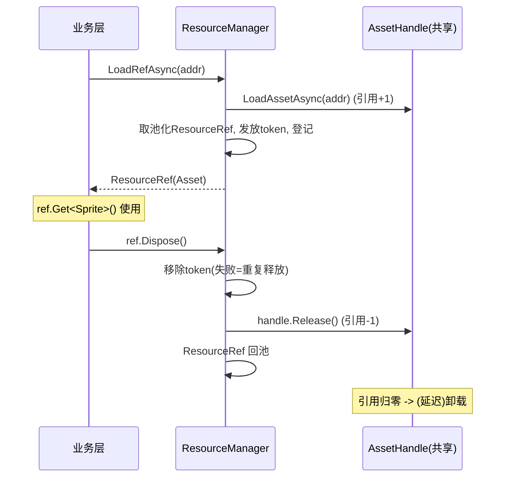

# ResourceRef 资源引用凭证 — 详细设计

> 本文是设计稿，不含落地代码。目标是评审通过后再实现。

## 1. 背景与动机

当前框架里 `AssetHandle` 代表「一份被加载出来的共享资源」：一个 address 对应一份，持有底层资源对象、引用计数和卸载委托，是**低层、共享、面向资源**的句柄。它不适合直接当作业务层的「持有凭证」，原因有二。

其一，`AssetHandle` 的引用计数是一个整数，`Retain/Release` 没有持有者身份。多个模块共享同一句柄时，谁多调了一次 `Release` 会错误地扣到别人头上，且无法定位。

其二，也是更关键的：**实例对象交出去之后无法追踪**。`IApplicable` 路径因为 `ResourceBinder` 按 target 记了绑定，还能追踪；但 `InstantiateAsync` 把 `ObjectPool.Get()` 出来的裸 `GameObject` 交给业务后，`ResourceManager` 就失联了——业务何时用完、是否 `Recycle`、是否自行 `Object.Destroy`，管理器一无所知。`IInstanceProvider`/`IInstantiator` 只是把「如何造、如何销毁」下放到 Unity 侧，并没有回答「谁还持有这个实例」。

`ResourceRef` 的定位就是补上这一层：**业务层面对的统一持有凭证**，位于 `AssetHandle` 之上。业务永远拿 `ResourceRef`、永远只 `Dispose` 一次；释放动作由管理器按来源分流（共享资源减引用、实例归还对象池）。这样实例的「在用/归还」第一次被管理器显式掌握，可做泄漏检测与场景切换强制回收。

设计借鉴了 MyFramework 的 `ResourceRef`（token 凭证、tokenSeed 放管理器、延迟卸载、copyRef 独立凭证、Unity 销毁语义防护），但适配到本框架的引擎无关 + 多来源（含 `byte[]`）结构上。

## 2. 定位与分层

引入后形成清晰的三层。底层是 `AssetHandle`（不变）：loaders 产出、按 address 缓存、引用计数 + 卸载委托，**转为框架内部节点**，业务不再直接持有。中层是 `ResourceRef`：业务面凭证，封装一次「持有」，带身份 token，`Dispose` 时把释放路由回管理器。上层是业务代码：只与 `ResourceRef` 和门面 API 打交道。

`ResourceRef` 本身保持引擎无关——它只持有 `object` + token + 来源类型；实例的真正回收/销毁仍通过 `ResourceManager` 转 `IInstanceProvider` 落到 Unity 侧。`AssetHandle` 的 `LoadAssetAsync` 等底层 API 仍保留给框架内部/系统级使用，业务层迁移到 `ResourceRef` API。

## 3. 两种来源，一个凭证

`ResourceRef` 背后有两种来源，对外是同一套使用方式。

资源型（Asset-backed）：背后是共享的 `AssetHandle`。用于 `Sprite`、`Material`、`byte[]`、以及「直接当原型用、不实例化」的预制体。多个持有者 = 多个 `ResourceRef` = 在同一 `AssetHandle` 上各占一份引用。`Get<T>()` 走 `handle.GetAsset<T>()`。`Dispose` → `handle.Release()`。

实例型（Instance-backed）：背后是从对象池取出的实例（当前即 `GameObject`）。`Get<T>()` 返回该实例。`Dispose` → 把实例 `Recycle` 回对象池（原型句柄仍由池持有）。这正是补上实例追踪的关键路径。

对外统一为：业务拿到 `ResourceRef`，用 `Get<T>()` 取对象，用完 `Dispose()`。业务不需要知道也不应关心它背后是共享资源还是池化实例。

## 4. 接口草案

`ResourceRef` 设计为**非泛型**，通过 `Get<T>()` 提供类型化访问（与 `AssetHandle.GetAsset<T>` 一致），并实现 `IDisposable` 支持 `using`。选非泛型的真实理由是「单池 + Manager 统一处理 + API 一致」，而非泛型不可池化：泛型 `ResourceRef<T>` 也能池化，但每个封闭类型要各自一个池（`Dictionary<Type, 池>` + 转型），且 Manager 的登记表与 `ReleaseRef` 入口要统一处理所有 ref，仍须引入一个非泛型基类/接口——绕一圈回到非泛型。至于「泛型静态字段」坑（每个封闭类型各有一份 `static`，会让 token 种子撞号），只要种子放在非泛型 `ResourceManager`（本设计正是如此）就已规避，与泛型与否无关。如确需调用点编译期类型安全，可在非泛型基类上再包一层轻量泛型外壳，该外壳只做转发、不进池。

```csharp
namespace ToolKit.Tools.Common
{
    public enum ERefKind { Asset, Instance }

    // 业务层持有的资源凭证 (引擎无关)。可被 ObjectPool 池化, 支持 using。
    public sealed class ResourceRef : IDisposable
    {
        private ResourceManager _owner;
        private ERefKind _kind;
        private IAssetHandle _handle;     // Asset 型: 背后共享句柄
        private object _instance;         // Instance 型: 池化实例
        private string _address;
        private long _token;              // 凭证身份, 用于重复释放/泄漏检测
        private bool _disposed;

        public ERefKind Kind => _kind;
        public string Address => _address;
        public long Token => _token;

        // 凭证是否仍有效 (未释放, 且底层资源/实例存活)
        public bool IsValid { get; }

        // 取对象。Instance 型返回实例; Asset 型返回 handle.GetAsset<T>()。
        // 已释放或已被引擎销毁则返回 null。
        public T Get<T>() where T : class;

        // 释放本凭证 (幂等; 重复释放会被 Manager 检测并报错)
        public void Dispose();

        // 复制出一份独立凭证 (语义见 §9)
        public ResourceRef AcquireRef();

        // —— 以下由 ResourceManager 调用 ——
        internal void SetupAsset(ResourceManager owner, IAssetHandle handle, long token);
        internal void SetupInstance(ResourceManager owner, string address, object instance, long token);
        internal void ResetForPool();     // 回池前清字段
    }
}
```

门面新增（业务面入口，取代直接发 handle/裸实例）：

```csharp
public interface IResourceManager // 增补
{
    // 资源型: 加载共享资源, 返回引用凭证 (引用已 +1)
    Task<ResourceRef> LoadRefAsync(
        string address, ELoadType loadType = ELoadType.Auto,
        IProgress<float> progress = null, CancellationToken ct = default);

    // 实例型: 实例化 (走对象池), 返回引用凭证
    Task<ResourceRef> InstantiateRefAsync(
        string address, CancellationToken ct = default);

    // 释放凭证 (由 ResourceRef.Dispose 调用; 也可显式调用)
    void ReleaseRef(ResourceRef refObj);

    // 诊断: 当前在用凭证数; 某 address 的在用实例数
    int LiveRefCount { get; }
    int GetLiveInstanceCount(string address);
}
```

token 注册表与种子放在**非泛型的 ResourceManager**（遵循文章「tokenSeed 不放泛型类」的教训）：

```csharp
private long _tokenSeed;
// 权威登记表: token -> 记录(address, kind)。兼顾重复释放检测与按地址泄漏统计。
private readonly Dictionary<long, RefRecord> _liveRefs = new();
private readonly ObjectPool<ResourceRef> _refPool; // 池化凭证对象本身
```

注意：登记表的 Key 用的是**自增 token**，不是资源对象本身。本框架缓存本就按 address 字符串组织，且资源可能是 `byte[]`（没有 `GetInstanceID`），因此不采用文章里 `GetInstanceID()` 作 Key 的做法——那是为「拿 UObject 当 Dictionary Key」准备的，本框架不存在这个场景。文章该点的底层告诫（Unity 销毁后对象语义）仍以另一种方式吸收，见 §8。

## 5. 生命周期流程

资源型加载与释放：



实例型实例化与归还（补上的追踪闭环）：

```mermaid
sequenceDiagram
    participant Biz as 业务层
    participant RM as ResourceManager
    participant P as ObjectPool(按address)
    Biz->>RM: InstantiateRefAsync(addr)
    RM->>P: Get() (池空则由原型实例化)
    RM->>RM: 取池化ResourceRef, 发放token, 登记(实例在用)
    RM-->>Biz: ResourceRef(Instance)
    Note over Biz: ref.Get<GameObject>() 使用
    Biz->>RM: ref.Dispose()
    RM->>RM: 移除token; 校验实例未被引擎销毁
    RM->>P: Return(instance) 归还对象池
    RM->>RM: ResourceRef 回池
```

对比当前实现：现在 `InstantiateAsync` 返回裸 `GameObject` 后管理器即失联；改为 `InstantiateRefAsync` 返回凭证后，发放/回收成对登记，`LiveRefCount`、`GetLiveInstanceCount` 可随时反映在用量，泄漏可查。

## 6. token 追踪：重复释放与泄漏检测

每个 `ResourceRef` 发放时拿到唯一 token 并登记进 `_liveRefs`。`ReleaseRef` 先尝试从登记表移除该 token：移除失败说明这张凭证已被释放过——即**重复释放**，报错并定位到具体 token/address，而不是当前那种「引用计数变负只能笼统报错」。

这里有一条必须遵守的实现约束：**真正的释放动作（`handle.Release()` 或实例 `Return`）必须以 token 成功移除为前提**。即先移除 token，仅当移除成功才执行底层释放；移除失败则只报错、不做任何释放。否则对同一张凭证重复 `Dispose` 会二次扣减 `AssetHandle` 引用，反而引发提前卸载——这正是 token 机制要防住的事。

泄漏检测：`_liveRefs` 即「已发放未归还」集合。可在场景切换或 `ResourceManager.Dispose` 时遍历，报告仍在用的凭证（尤其实例型——意味着业务忘了 `Dispose`），并按策略强制回收。`GetLiveInstanceCount(address)` 便于定位是哪类资源在泄漏。

这套 token 身份同时解决了 `AssetHandle` 整数计数无法区分持有者的问题：每张凭证独立记账，互不干扰。

## 7. 与对象池结合

两层池化各司其职。其一，`ResourceRef` 对象本身小而高频（每次交付都产生一个），用现有 `ObjectPool<ResourceRef>` 池化，`Dispose → 移除token → ResetForPool → 回池`，与 MyFramework 的 `ClassObject` 思路一致。其二，实例型背后的 `GameObject` 实例仍走 §4.6 已有的实例 `ObjectPool`，`ResourceRef.Dispose` 触发 `Recycle`。两层池互不耦合：一次实例型释放，先把 GameObject 还回实例池，再把 ResourceRef 还回凭证池。

## 8. 与缓存池 / 延迟卸载结合，及 Unity 销毁防护

资源型最后一张凭证释放 → `AssetHandle` 引用归零 → 走（建议同时引入的）延迟卸载 → 内容可能仍驻留在 `LocalFileLoader` 的 LRU 缓存里，再次 `LoadRefAsync` 直接复活。整条链路语义一致：凭证管「业务持有」，句柄管「资源共享」，LRU/延迟卸载管「物理驻留」。

Unity 销毁语义防护（吸收文章第五节的告诫，但落点不同）：实例型 `ResourceRef` 在 `Get<T>()` 与回收时，必须判断底层实例是否已被引擎销毁（Unity 重载了 `==`，C# 引用还在但逻辑上已 null）。已销毁的实例：`Get` 返回 null、`IsValid` 为假、回收时**不再入池**（直接丢弃 token、不调用 `Return`），避免把死对象塞回池子。该判断本身是引擎相关的，由 `IInstanceProvider` 增补一个 `bool IsAlive(object instance)` 来承担，保持 Manager 引擎无关。

## 9. AcquireRef（对应文章 copyRef）的语义

资源型：`AcquireRef()` 复制出独立凭证——`handle.Retain()` + 新 token + 新 `ResourceRef`。用于「一份共享资源交给多个模块，各自独立释放，最后一张凭证释放后资源才允许卸载」。这与文章 copyRef 完全对应。

实例型：一个 `GameObject` 实例无法被两个所有者独立持有，所以实例型**不支持** `AcquireRef`（调用应报错或显式禁用）。若业务需要「再来一个」，语义上应是再 `InstantiateRefAsync` 取一个新实例，而非复制凭证。文档/接口需把这点讲清，避免误用。

## 10. 与 ResourceBinder 的关系

`ResourceBinder` 当前内部持有 `IAssetHandle`。引入后，它可以改为持有资源型 `ResourceRef`：`ApplyAsync` 内部走 `LoadRefAsync` 拿凭证、应用到 target、按 generation 作废旧凭证时 `Dispose` 旧 `ResourceRef`。这样绑定器与一般业务持有走同一套凭证账目，`CancelApply`/`Unbind` 的释放也统一为 `ResourceRef.Dispose`。属于受益的小重构，可与本设计一并实施或随后跟进。

## 11. 迁移方案

分三步，保证过程可控。第一步新增而不破坏：加入 `ResourceRef`、`ERefKind`、`RefRecord`、凭证池、token 登记表，以及 `LoadRefAsync`/`InstantiateRefAsync`/`ReleaseRef` 与诊断 API；`IInstanceProvider` 增补 `IsAlive`。此时旧的 `LoadAssetAsync`/`InstantiateAsync` 仍在。第二步业务面切换：业务代码统一改用 `ResourceRef` API，`AssetHandle`/`IAssetHandle` 降为框架内部（loaders、缓存、ResourceBinder 内部继续用）。第三步收口：`ResourceBinder` 内部改持 `ResourceRef`；保留 `LoadAssetAsync` 仅供系统级/高级用途，或加注释标注「内部使用」。

## 12. 取舍与已决策

代价是每次交付多一层凭证对象与一次 token 记账，靠凭证池化 + 「仅在交给业务层时才包 `ResourceRef`、框架内部仍可直接用 handle」摊薄，整体可接受。

四个设计问题已拍板。

**凭证类型：采用非泛型 `ResourceRef` + `Get<T>()`。** 理由是单池、Manager 可统一处理、与 `AssetHandle.GetAsset<T>` 一致。泛型并非不可池化，但需「每封闭类型一个池 + 非泛型基类」才能统一处理，绕回非泛型；而「泛型静态字段撞号」坑只要把 token 种子放非泛型 Manager 即已规避（与泛型与否无关）。需要编译期类型安全时，可在非泛型基类上加一层只做转发、不进池的泛型外壳。

**泄漏处理：按构建配置分级。** DEBUG（含 Editor / 开发包）下，发现未归还凭证直接强制回收（实例型强制 `Return`/销毁，资源型强制 `Release`）并 `Log.Error` 报错定位；RELEASE 下仅告警、不强制改变行为。落地需注意当前 `ILog` 只有 `Info/Debug/Error`、缺 `Warn`——建议给 `ILog` 补 `Warn`，否则 RELEASE 的告警暂用 `Info`。强制回收逻辑用 `[Conditional("DEBUG")]` 或 `#if DEBUG` 隔离，避免进发布包。

**并发粒度：token 登记表单锁。** Unity 的 `AsyncOperation.completed`、`Resources`/`AssetBundle` 回调均在主线程，异步 loader 续体也基本回主线程，真正可能在后台线程触发登记表写入的仅文件/网络读取完成那一下；登记表操作极短，单锁足够，不引入分段锁。

**`using` 支持：`ResourceRef : IDisposable`。** `Dispose()` 即释放凭证。因 `ResourceRef` 是池化对象，须加安全栅栏：`Dispose` 后置 `_disposed=true` 并清空字段，之后 `Get<T>()` 返回 null、`IsValid` 为假；防止 `using` 结束、对象已回池并被复用为另一资源后，外部仍持旧引用误用。可选地为「同一张凭证被 Dispose 两次」叠加 token 移除失败检测（见 §6），双重兜底。

## 13. 下一轮落地清单（评审通过后）

新增：`Core/ResourceRef.cs`（`: IDisposable`）、`Core/ERefKind.cs`、`Core/RefRecord.cs`（或内嵌）。修改：`Definition/IResourceManager.cs`（增 Ref API 与诊断）、`Definition/IInstanceProvider.cs`（增 `IsAlive`）、`ResourceManager.cs`（凭证池 + token 登记 + 发放/回收 + 路由 + 分级泄漏检测）、`UnityToolKit/Engine/.../GameObjectInstanceProvider.cs`（实现 `IsAlive`）、`Common/Log.cs`（给 `ILog` 补 `Warn`）、`ResourceBinder.cs`（内部改持 `ResourceRef`，可选）。文档：更新主设计文档与 UML 类图。建议与「延迟卸载」一并实施，二者在生命周期末端天然衔接。
