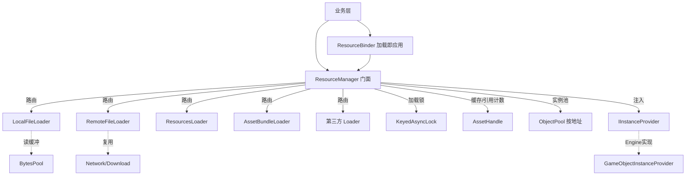
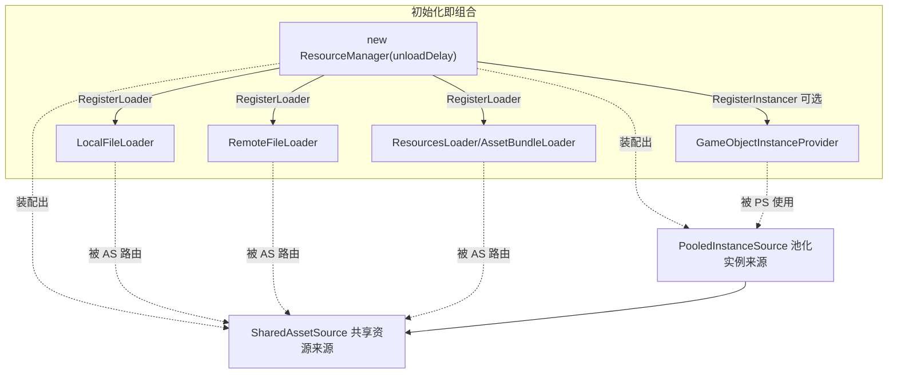
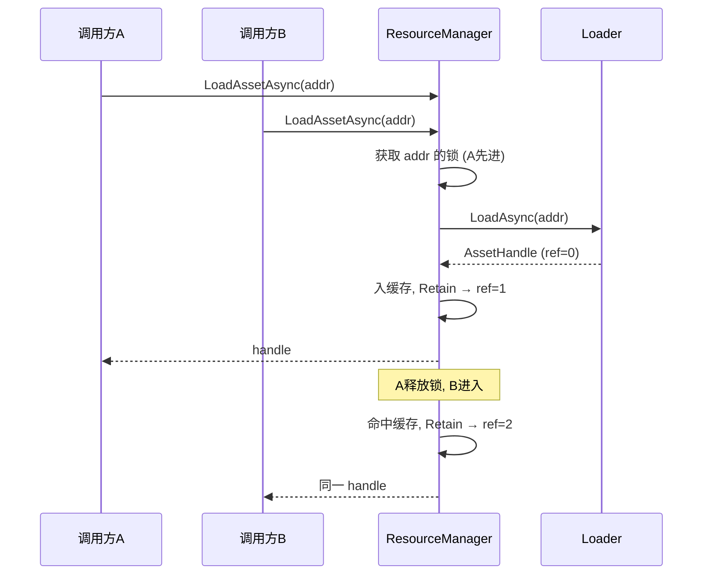
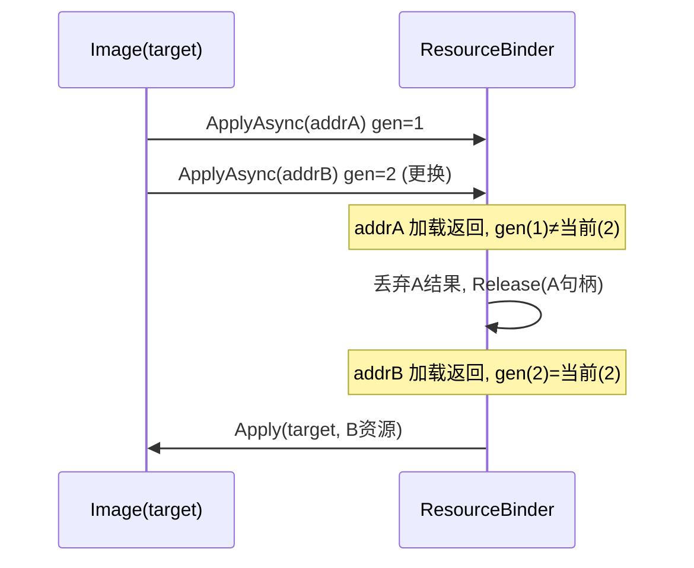

# 资源加载系统 (ResourceSystem) 设计文档

## 1. 目标与范围

本系统为 ToolKit 提供一套统一的资源加载框架，覆盖四类来源：本地文件、远程文件、Unity Resources、Unity AssetBundle，并预留第三方加载器（Addressables / YooAsset 等）的接入点。框架要解决的核心问题包括：用统一入口屏蔽不同来源的加载差异、用引用计数管理资源生命周期并自动卸载、用加载锁保证同一资源只加载一次、用对象池复用实例化的 GameObject。

设计上严格遵循项目已有的程序集边界。`ToolKit.Tools` 程序集设置了 `noEngineReferences: true`，因此所有抽象接口与全平台通用的实现（本地/远程文件、引用计数、加载锁、门面、实例对象池、绑定器）都放在这里，保持引擎无关；而 Resources、AssetBundle、GameObject 的实例化这些依赖 `UnityEngine` 的部分，放在 `UnityToolKit.Engine` 程序集中（它已引用了 `ToolKit.Tools`）。关键在于：实例对象池本身（`ObjectPool<T>`、池的生命周期）是引擎无关的，只把"如何实例化/销毁一个对象"这件引擎相关的事通过 `IInstanceProvider` 注入，由 Engine 层提供 `GameObjectInstanceProvider`。这样核心框架可以脱离 Unity 单元测试，引擎相关代码则隔离在 Engine 层。

## 2. 分层结构

系统按职责分三层，依赖单向朝下、无环。门面层 `ResourceManager` 是业务唯一入口，自身只管「业务凭证」（`ResourceRef` 发放、token 登记、重复释放/泄漏检测、凭证池），把加载与池化分别委托给下面两层。加载层 `SharedAssetSource`（程序集内部）负责把地址变成共享、引用计数、可延迟卸载的 `AssetHandle`：加载器路由、`KeyedAsyncLock`、句柄缓存、引用归零→延迟卸载、`CollectUnused`；它不认识实例池与凭证。池化层 `PooledInstanceSource`（程序集内部，依赖 `SharedAssetSource`）负责把原型实例化成可复用副本：按地址的 `ObjectPool`、原型持有、`CanInstantiate` 护栏、在用实例计数；它不认识凭证与 token。`ResourceManager`、`SharedAssetSource`、`PooledInstanceSource` 三者只有 `ResourceManager` 对外公开。两个来源都实现统一的内部接口 `IBackingSource`（按 key 产出一份可释放持有 `IRefBacking`），门面据此把 `LoadRefAsync` / `InstantiateRefAsync` 收束为同一条发放路径，也为「按资源类型组合来源」留出扩展点。命名上特意区分：`SharedAssetSource` 是「按 key 给共享句柄」的缓存（每个 key 唯一、共享、引用计数，不是对象池），`PooledInstanceSource` 是「按 key 给池化实例」的多池管理器（它管理多个 `ObjectPool`，本身不是一个池）。锁的归属也理清了：纯净的 `ObjectPool<T>` 不持锁；`PooledInstanceSource` 只持一把廉价 Monitor，原型加载去重直接复用 `SharedAssetSource` 的加载锁、建池竞争用同步锁解决（输家归还多拿的原型引用），不再有独立的池创建异步锁。再往下是加载器层（实现 `ILoader`）与支撑设施：`AssetHandle`、`KeyedAsyncLock`、`ObjectPool<T>`、`BytesPool`，以及复用的下载模块。



代码按职责分目录组织。引擎无关层位于 `Tools/Common`：`ResourceSystem/Definition`（接口与枚举：`ELoadType`、`ILoader`、`IAssetHandle`、`IInstanceProvider`、`IApplicable`；门面 `ResourceManager`、`ResourceBinder` 均为单一实现、不设接口，实例化方法直接公开在 `ResourceManager` 上）、`ResourceSystem/Core`（`AssetHandle`、`ELoadStatus`、`ResourceRef`、`ERefKind`，消除 kind 分支的 `IRefBacking`/`AssetBacking`/`InstanceBacking`，以及统一来源接口 `IBackingSource`）、`ResourceSystem/Loading`（`SharedAssetSource` 加载层）、`ResourceSystem/Instancing`（`PooledInstanceSource` 池化层）、`ResourceSystem/Loaders`（`LocalFileLoader`、`RemoteFileLoader`）、`ResourceSystem` 根目录（门面 `ResourceManager`、`ResourceBinder`）、`AsyncLockSystem`（`KeyedAsyncLock`）、`Pool`（已有的 `SimplePool` 之外新增 `ObjectPool<T>`、`BytesPool`）。其中 `SharedAssetSource`、`PooledInstanceSource` 及三个 backing 均为 internal，业务只面对 `ResourceManager`。引擎相关层 `UnityToolKit.Engine.ResourceSystem` 包含：`ResourcesLoader`、`AssetBundleLoader`、`GameObjectInstanceProvider`。

### 2.1 组合装配：让「组合」体现在过程上

整套框架是「组件 + 系统」的组合：加载器(`ILoader`)、实例器(`IInstanceProvider`)是干活的组件；共享资源来源(`SharedAssetSource`)、池化实例来源(`PooledInstanceSource`)是管理它们的系统；`ObjectPool<T>` 是纯净的池组件。但「组合」不应只是构造函数里写死的结果，而应在**初始化过程**中显式体现：`ResourceManager` 构造时只配核心选项，能力靠一串 `Register*` 装配进来。读这段初始化，就读到了「这个资源系统由哪些组件拼成」——组合成了写出来的、可见的、可增减的动作，而非黑箱实现细节。

实例器是可选组件：不 `RegisterInstancer` 就不具备实例化能力，调用实例化 API 会抛出明确异常。这正是「节点可选、按需组合」的体现。子系统仍为 internal，装配通过门面的注册方法完成，因此既保留极简门面、不暴露内部，又让组合在流程上可见。



## 3. 核心接口

`ILoader` 是整个框架的扩展点。它声明了 `LoadType`（负责的来源类型）、`CanLoad(address)`（能否处理某地址，用于自动路由）以及 `LoadAsync(address, cancellationToken)`。任何新的加载来源——无论是引擎自带的还是第三方的——都只需实现这个接口并注册到 `ResourceManager`，无需改动框架其它部分。加载器本身不关心引用计数、缓存和加载锁，它的唯一职责是产出一份 `AssetHandle`。

`IAssetHandle` 表示一份"只加载一次"的底层资源。它暴露地址、加载状态、引用计数、是否成功、错误信息，以及 `Retain` / `Release` / `GetAsset<T>`。本地与远程文件的底层资源是 `byte[]`，Resources 与 AssetBundle 的底层资源是 `UnityEngine.Object`，业务通过 `GetAsset<T>()` 按需取出。

`ResourceManager` 是业务面对的唯一门面（单一实现，不再设 `IResourceManager` 接口），提供 `RegisterLoader`、`LoadAssetAsync`、`TryGetCached`，以及推荐业务层使用的凭证 API `LoadRefAsync` / `InstantiateRefAsync` / `ReleaseRef` 和延迟卸载 `CollectUnused`。它还直接公开实例化方法（`Instantiate` / `InstantiateAsync` / `Recycle`），并把加载与池化分别委托给内部的 `SharedAssetSource` 与 `PooledInstanceSource`（见 §2）。`ResourceRef`（见 §4.8）是业务层持有的统一凭证，位于 `AssetHandle` 之上，封装资源型/实例型两种持有并以 token 记账。`IInstanceProvider` 把引擎相关的"创建/激活/失活/销毁/存活判断"抽象出来注入，使实例池与凭证保持引擎无关。`ResourceBinder` 则把"加载 + 应用到目标"封装成一步。

## 4. 关键机制

### 4.1 同一资源只加载一次（缓存 + 加载锁）

`ResourceManager` 内部维护 `address -> AssetHandle` 的缓存表。当多个调用方并发请求同一地址时，第一个请求会真正触发加载，其余请求必须等待并复用同一句柄，否则会出现重复下载或重复加载的浪费。这一保证由 `KeyedAsyncLock` 实现：它为每个地址维护一个容量为 1 的信号量，同一地址的临界区串行执行，不同地址互不阻塞，且全程基于 `SemaphoreSlim.WaitAsync` 不阻塞线程。锁内先查缓存命中则直接复用，未命中才走真实加载，加载完成后写入缓存。等待计数归零时，对应的信号量会被回收，避免字典无限膨胀。



### 4.2 引用计数与自动卸载

`AssetHandle` 持有引用计数和一个"卸载委托"。卸载委托由创建它的加载器注入，因为不同来源的卸载方式不同：`byte[]` 只需置空，Resources 非 GameObject 资源用 `Resources.UnloadAsset`，AssetBundle 资源则递减 bundle 级引用并在归零时 `Unload(false)`。每次 `LoadAssetAsync` 命中或新建都会 `Retain` 一次，业务用完调用一次 `Release`，一一对应。当计数归零，句柄先执行卸载委托释放底层资源，再回调 `ResourceManager` 把自己从缓存表移除，从而彻底回收。整个加减计数在锁内完成，保证并发安全。

### 4.3 异步与取消

所有加载基于 `Task` + `CancellationToken`。取消令牌触发时，加载器会把句柄状态置为 `Cancelled`，远程下载还会调用底层 `DownloadTask.Cancel()` 中止传输。

通用加载 API **不上报进度**：本地文件、Resources、AssetBundle 这类加载几乎是瞬时完成的，一个穿过整条加载链的 `IProgress<float>` 只是签名噪音且会把信息压扁。进度真正有意义的只有远端下载，而它有更合适的专用通道——`RemoteFileLoader` 暴露 `event Action<string url, DownloadProgress> OnDownloadProgress`，由其内部从 `DownloadTask.OnProgress` 转发，`DownloadProgress` 带字节数、速度、比率等完整信息。需要下载进度（如下载进度条）的业务订阅这个事件即可，通用路径保持干净。

### 4.4 远程下载与本地缓存

`RemoteFileLoader` 复用了 `Network/Download` 模块，做到「下载一次、之后走本地」：命中本地缓存文件则直接读取，未命中才通过 `SimpleDownloader` 下载（自带断点续传与失败重试），下载完成再读为 `byte[]` 包装成句柄。

缓存路径策略**可注入**：构造时既可传 `cacheRoot`（默认策略：URL 的 MD5 + 原扩展名落在该目录下），也可传一个 `Func<string url, string localPath>` 自定义映射。自定义映射有两个价值——一是掌控缓存布局（按 URL 路径镜像成目录、人类可读名、按版本分目录）；二是支持「预置缓存」：把文件提前按映射规律放到对应 path，首次加载就直接命中本地、连第一次下载都省了。需要注意：框架透明地处理「有缓存读本地 / 没有才下载」这个决策，调用方只管说「加载这个 URL」，不需要自己判断走远端还是本地。一个常见组合用法是：远程下载得到 bundle 文件后，把本地路径交给 `AssetBundleLoader` 加载，实现"远程 AssetBundle"。

### 4.5 本地文件的两级缓存

远程加载靠磁盘缓存避免重复下载，本地加载则补上两层内存层面的优化。其一是内存内容缓存：`LocalFileLoader` 内置一个容量有限的 LRU，缓存读出的 `byte[]`。即便句柄引用归零、资源被卸载，内容仍可在 LRU 中保留一段时间，再次请求时直接命中、省去重复读盘——相当于一层弱缓存 / 延迟卸载。LRU 按最近最少使用淘汰，并对单文件设大小上限（默认 512KB），超过则不进缓存，避免大文件挤占内存。需要注意缓存的 `byte[]` 在多个调用方之间共享，约定为只读。其二是字节缓冲区池：读盘的传输缓冲通过 `BytesPool`（封装 `ArrayPool<byte>`）借还，结果数组按文件长度一次性分配，避免每次读取都产生临时大缓冲。`RemoteFileLoader` 读取磁盘缓存时同样复用 `BytesPool`。

### 4.6 实例化与对象池（集成进 ResourceManager）

实例对象池直接集成在 `ResourceManager` 里，而不是独立组件。`ResourceManager` 直接公开 `Instantiate` / `InstantiateAsync` / `Recycle`：首次对某地址 `InstantiateAsync` 时，它先经由自身的加载流程取得预制体原型句柄（持有一份引用），再以该原型为工厂建一个 `ObjectPool<object>`；之后取实例走池、`Recycle` 归还，避免频繁 `Instantiate/Destroy` 带来的 GC 与卡顿。`ReleasePooledInstanceSource` 或 `Dispose` 时销毁池中实例并释放原型引用。

通用对象池 `ObjectPool<T>` 放在 `Common/Pool`，与已有的 `SimplePool` 互补。`SimplePool<T>` 要求 `T` 实现 `ISetupable/IClearable/IDisposable` 并在池空时用无参构造自动创建，适合纯 C# 对象；但 `GameObject` 既不满足这些约束也无法无参构造。`ObjectPool<T>` 改用注入的工厂委托与 `onGet/onReturn/onDestroy` 回调，因此能池化任何"无法无参构造"的对象。引擎相关的实例化细节（`Object.Instantiate`、`SetActive`、`Object.Destroy`）被收敛到 `IInstanceProvider`，由 Engine 层的 `GameObjectInstanceProvider` 实现并注入。如此一来，池的生命周期管理是引擎无关的、可单测的，只有最末端的实例创建/销毁落在引擎层。

这里有一条重要的角色约束：可被应用的共享资源不可被池化。`Sprite`、`Material`、`byte[]` 这类资源是被 `Apply` 直接绑定到目标的共享对象，由引用计数的 `AssetHandle` 管理，全程只有一份、不复制；而实例池针对的是从原型 `Instantiate` 出来的独立副本（`GameObject`）。两者语义相反，绝不能混用——否则会把一份共享资源当成副本反复"实例化"，引发引用与生命周期混乱。问题在于 `GameObject` 与 `Sprite` 同为 `UnityEngine.Object`，无法用标记接口在类型层面隔离。框架因此改为按角色判定：`IInstanceProvider` 暴露 `CanInstantiate(prototype)`，`GameObjectInstanceProvider` 只对 `GameObject` 原型返回真；`ResourceManager` 在建池前校验，一旦发现某地址指向的是可应用的共享资源便抛出明确异常并释放其引用，从源头挡住"把可应用对象拿去池化"的误用。

### 4.7 加载即应用（ResourceBinder 集成 IApplicable）

很多场景需要"加载完直接用到某个目标上"，例如把远程头像加载成 `Sprite` 赋给一个 `Image`。`ResourceBinder` 把这一步封装为 `ApplyAsync(target, address, applicable)`：内部走 `ResourceManager` 加载，成功后通过 `IApplicable.Apply(target, resource)` 应用。难点在异步时序，`ResourceBinder` 以 target 为单位维护一个绑定状态（generation 代号 + 当前句柄）来处理三种情况。

加载中取消应用：若传入的 `CancellationToken` 被取消，加载抛出取消异常，绑定器直接返回、不应用，target 上原有资源保持不变。加载中更换资源（以最后一次为准）：每次 `ApplyAsync` 都会自增该 target 的 generation，从而作废之前所有未完成的请求；当某个加载完成时先比对 generation，若已不是最新（说明期间又发起了新地址请求），就丢弃这次结果并释放其句柄，绝不把过期资源应用上去。重复加载应用：应用成功后，绑定器释放该 target 上一次持有的句柄、切换到新句柄；即使前后是同一地址（命中缓存拿到同一 `AssetHandle`），多出的那次引用也会在这里被正确释放，不会泄漏。

绑定器提供两个取消语义不同的接口。`CancelApply(target)` 是单纯取消应用：只自增 generation 作废进行中的加载请求，使其完成后不再 Apply，但 target 当前已应用的资源与其句柄保持不动——适合"中途不想要这次切换、但要保留现状"的场景。`Unbind(target)` 则是彻底解绑：既作废进行中的请求，也释放 target 当前持有的句柄（引用归零即卸载），适合目标销毁或不再使用资源时调用。



### 4.8 业务凭证 ResourceRef

`AssetHandle` 是低层、共享、面向资源的句柄（一 address 一份、整数引用计数），不适合直接当业务持有凭证：整数计数没有持有者身份，无法定位重复释放；更关键的是实例对象交出去后无法追踪。`ResourceRef` 是 `AssetHandle` 之上的**业务面统一凭证**，封装一次「持有」，业务永远拿 `ResourceRef`、永远只 `Dispose` 一次（支持 `using`）。

它背后有两种来源，对外同一套用法。资源型背后是共享 `AssetHandle`（`Sprite`/`Material`/`byte[]` 等），`Get<T>()` 走 `handle.GetAsset<T>()`，`Dispose` → 句柄引用 −1。实例型背后是从对象池取出的实例（`GameObject`），`Get<T>()` 返回实例，`Dispose` → 实例归还对象池。两种来源由 `ResourceManager.LoadRefAsync` 与 `InstantiateRefAsync` 分别发放。实例型正是补上了之前的追踪盲区：实例发放/归还成对登记，`LiveRefCount` 与 `GetLiveInstanceCount(address)` 随时反映在用量。

每张凭证发放时由非泛型的 `ResourceManager` 分配唯一 token 并登记（token 种子放 Manager，避免泛型类各自静态字段撞号）。`ReleaseRef` 先从登记表移除 token，**仅当移除成功才执行底层释放**——移除失败即重复释放，报错并定位到具体 token/address，绝不二次扣减引用。登记表也是「已发放未归还」集合，`Dispose` 时据此做泄漏检测：DEBUG 下强制回收并 `Log.Error`，RELEASE 下 `Log.Warn`。`ResourceRef` 对象本身小而高频，用 `ObjectPool` 池化；`Dispose` 后置位并清空字段，防止 `using` 结束、对象回池复用后外部仍持旧引用误用。`AcquireRef()`（对应 MyFramework 的 copyRef）仅资源型支持，复制出独立引用 + 独立 token，供多模块各自释放；实例型不支持，需要新实例应重新 `InstantiateRefAsync`。

Unity 销毁防护：实例型凭证 `Get`/回收时会经 `IInstanceProvider.IsAlive` 判断实例是否已被引擎 `Destroy`（Unity 重载了 `==`，C# 引用还在但逻辑为 null）；已销毁的实例 `Get` 返回 null、回收时不再入池。

### 4.9 延迟卸载

引用归零不再立即卸载。`AssetHandle` 计数归零时只通过 `OnReachedZero` 通知 `ResourceManager`，由 Manager 决定时机：构造时 `unloadDelaySeconds <= 0` 则立即卸载（默认，向后兼容）；大于 0 则把地址登记进待卸载表、资源暂留缓存。期间若再次 `LoadRefAsync`/`LoadAssetAsync` 命中缓存，`Retain` 的同时撤销待卸载即「复活」，省去重复加载、避免同一帧加载/卸载抖动。真正卸载由外部周期性调用 `CollectUnused()` 推进：扫描待卸载表，对仍为零引用且超过延迟时间的资源调用 `AssetHandle.Unload()` 并移出缓存；已复活或已不在缓存的条目顺带清理。该方法引擎无关，由 Unity 侧主循环驱动。这与本地文件 LRU、`ResourceRef` 在生命周期末端天然衔接。

## 5. 典型用法

初始化即「显式组合」：构造一个空的 `ResourceManager`（只配延迟卸载这种核心选项），随后通过一串 `Register*` 把组件逐个插入——读这段初始化代码就能看出这个资源系统由哪些组件装配而成。实例器是可选的，不注册就不支持实例化。注意 `ResourcesLoader` 作为兜底匹配器应放在自动路由列表末位：

```csharp
// 引用归零后延迟 5 秒卸载; 传 0 则立即卸载
var res = new ResourceManager(unloadDelaySeconds: 5);

// —— 装配: 插入加载器组件 ——
res.RegisterLoader(new RemoteFileLoader(Application.persistentDataPath));
res.RegisterLoader(new LocalFileLoader());
res.RegisterLoader(new AssetBundleLoader());
res.RegisterLoader(new ResourcesLoader());          // 兜底, 放最后

// —— 装配: 插入实例器组件 (可选; 不需要实例化可省略) ——
res.RegisterInstancer(new GameObjectInstanceProvider(), poolCapacity: 100);

// 在主循环里周期性推进延迟卸载
void Update() => res.CollectUnused();
```

加载与释放（业务面用 ResourceRef，支持 using）：

```csharp
using (var refObj = await res.LoadRefAsync("UI/MainPanel"))
{
    var prefab = refObj.Get<GameObject>();
    // ... 使用 ...
} // 离开作用域自动 Dispose -> 句柄引用 -1 -> (延迟)卸载
```

实例化与回收（实例池已集成，凭证 Dispose 即归还对象池）：

```csharp
var inst = await res.InstantiateRefAsync("Prefabs/Enemy");
var go = inst.Get<GameObject>();
// ... 使用 ...
inst.Dispose(); // 实例归还对象池; 管理器同步更新在用实例数
```

加载即应用（同一 Image 快速切换头像，自动以最后一次为准）：

```csharp
var binder = new ResourceBinder(res);
// applicable 由业务实现: 把 Sprite 赋给 Image
await binder.ApplyAsync<Image, Sprite>(image, urlA, spriteApplicable);
await binder.ApplyAsync<Image, Sprite>(image, urlB, spriteApplicable); // urlA 结果会被作废
binder.Unbind(image); // 不再需要时解绑并释放
```

## 6. 扩展点与后续工作

接入第三方加载器只需实现 `ILoader`（`LoadType` 设为 `ELoadType.Custom`），在内部封装 Addressables 或 YooAsset 的加载与卸载，再注册即可，框架的缓存、引用计数、加载锁、实例池、绑定器都自动生效。后续可考虑增强的方向包括：AssetBundle 依赖清单（manifest）的自动解析与依赖加载、批量/并发加载调度器、以及按资源类型声明式组合加载来源（基于 `IBackingSource`）。
