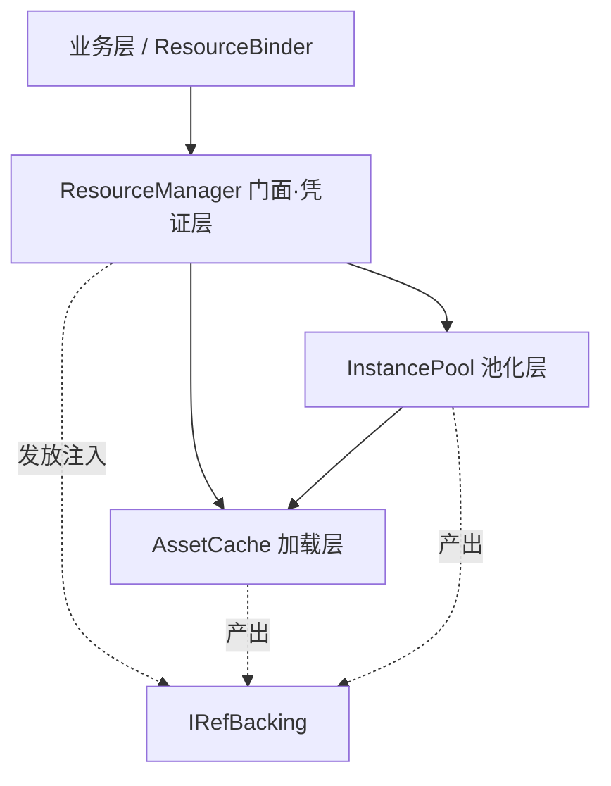

# ResourceSystem 分层重构设计

> 本文是重构设计稿，不含落地代码。目标是把"上帝类"`ResourceManager` 按职责拆成单向依赖的几层，并用多态消除 `if (kind == Asset/Instance)` 的分支耦合。**对外行为与 API 完全不变，纯结构重构。**

## 1. 现状问题

`ResourceManager` 一个类承担了四件本应分离的事：加载器路由 + `AssetHandle` 缓存 + 延迟卸载、实例对象池（原型句柄 + `ObjectPool` + `CanInstantiate`）、`ResourceRef` 发放 + token 登记 + 泄漏检测。其中「加载缓存」和「实例池」本无直接关系，却挤在同一个类里互相可见，读起来负担重。

更具体的耦合是分支：`ResourceRef.Get<T>`、`ResourceRef.IsValid`、`ResourceManager.ReleaseRef` 各有一处 `if (kind == Asset) … else …`，把「资源型」和「实例型」两条路缝在同一段代码里。新增第三种来源就得改这三处。

## 2. 目标分层

拆成三层，依赖**只朝下**，无环：



加载层不知道实例池、凭证、token 的存在；池化层只依赖加载层取原型，不知道凭证；门面组合两者并负责凭证。这样「加载」和「池化」在代码上真正分开。

### 2.1 加载层 AssetCache（internal）

只管「把地址变成共享、引用计数、可延迟卸载的 `AssetHandle`」。

职责：loader 注册与路由、`KeyedAsyncLock`、`address -> AssetHandle` 缓存、引用归零→延迟卸载、`CollectUnused`。

对外（assembly internal）：

```csharp
internal sealed class AssetCache
{
    public AssetCache(double unloadDelaySeconds = 0);
    public void RegisterLoader(ILoader loader);
    public Task<AssetHandle> LoadHandleAsync(string address, ELoadType, IProgress<float>, CancellationToken);
    public bool TryGetCached(string address, out AssetHandle handle);
    public void CollectUnused();
    public int CachedCount { get; }
}
```

持有：`_cache`、`_loaders`/`_loadersByType`、`_loadLock`、`_pendingUnload`、`_unloadDelay`、`_cacheGate`。负责给每个成功句柄挂 `OnReachedZero` 并处理立即/延迟卸载与复活。这一层从现有 `ResourceManager` 的「加载」region 整体搬出来即可，逻辑不变。

### 2.2 池化层 InstancePool（internal）

架在加载层之上，只管「把原型实例化成可复用的副本」。

职责：按 address 的 `ObjectPool<object>`、原型句柄持有、`CanInstantiate` 护栏、`IInstanceProvider`、在用实例计数、池创建串行化（自带一把 `KeyedAsyncLock`，与加载锁解耦）。

对外（assembly internal）：

```csharp
internal sealed class InstancePool
{
    public InstancePool(AssetCache cache, IInstanceProvider provider, int capacity = 100);
    public Task<object> AcquireAsync(string address, CancellationToken);   // 经 cache 取原型 -> 建池 -> 取实例; 计数+1
    public void Release(string address, object instance);                  // IsAlive 则归还池, 否则丢弃; 计数-1
    public bool IsAlive(object instance);
    public int GetLiveCount(string address);
    public void ReleaseInstancePool(string address);
    public void Clear();
}
```

持有：`_pools`、`_prototypes`、`_liveCounts`、`_instGate`、`_poolLock`、`_provider`、`_capacity`。它用 `cache.LoadHandleAsync` 取原型（原型句柄的那份引用由本层持有，直到 `ReleaseInstancePool`/`Clear`）。「在用实例数」是池化层自己的概念，计数留在本层。

### 2.3 门面·凭证层 ResourceManager（public，唯一对外入口）

组合上面两层，只管「业务凭证」：`ResourceRef` 发放、token 登记、重复释放/泄漏检测、凭证池。`AssetCache` 与 `InstancePool` 设为 internal，业务只面对 `ResourceManager`。

```csharp
public sealed class ResourceManager : IResourceManager, IInstantiator
{
    private readonly AssetCache _cache;
    private readonly InstancePool _instances;

    public ResourceManager(IInstanceProvider provider = null, int instancePoolCapacity = 100, double unloadDelaySeconds = 0);

    public void RegisterLoader(ILoader loader)            => _cache.RegisterLoader(loader);
    public Task<IAssetHandle> LoadAssetAsync(...)         => _cache.LoadHandleAsync(...);   // 兼容旧 API
    public void CollectUnused()                           => _cache.CollectUnused();
    public int  GetLiveInstanceCount(string addr)         => _instances.GetLiveCount(addr);

    public Task<ResourceRef> LoadRefAsync(...);           // cache 取句柄 -> AssetBacking -> 发放
    public Task<ResourceRef> InstantiateRefAsync(...);    // instances 取实例 -> InstanceBacking -> 发放
    public void ReleaseRef(ResourceRef refObj);           // 校验 token -> backing.Release() -> 回池 (无 if kind)
}
```

持有：`_liveRefs`、`_tokenSeed`、`_refPool`、`_refGate`。

## 3. 用多态消除 kind 分支

核心做法：不让 `ResourceRef` 知道自己是哪种，给它一个「背书」对象，发放时由对应的层注入「怎么取、是否有效、怎么释放」。

```csharp
internal interface IRefBacking
{
    T Get<T>() where T : class;
    bool IsAlive { get; }
    void Release();
    string Address { get; }      // 诊断用
    ERefKind Kind { get; }       // 仅作日志标签, 不再用于流程分支
}

// 由加载层语义发放
internal sealed class AssetBacking : IRefBacking
{
    IAssetHandle _handle;
    public T Get<T>()    => _handle?.GetAsset<T>();
    public bool IsAlive  => _handle != null && _handle.IsSuccess;
    public void Release()=> _handle?.Release();
}

// 由池化层语义发放
internal sealed class InstanceBacking : IRefBacking
{
    InstancePool _pool; string _address; object _instance;
    public T Get<T>()    => _pool.IsAlive(_instance) ? _instance as T : null;
    public bool IsAlive  => _instance != null && _pool.IsAlive(_instance);
    public void Release()=> _pool.Release(_address, _instance);
}
```

`ResourceRef` 退化成只拿着一个 backing 和一个 token 的薄壳：

```csharp
public sealed class ResourceRef : IDisposable
{
    private IRefBacking _backing;
    private long _token;
    private ResourceManager _owner;
    private bool _disposed;

    public T Get<T>() where T : class => _disposed ? null : _backing.Get<T>();
    public bool IsValid               => !_disposed && _backing.IsAlive;
    public string Address             => _backing?.Address;
    public void Dispose()             => _owner?.ReleaseRef(this);
    public ResourceRef AcquireRef();  // 仅 AssetBacking 支持, 由 owner 复制句柄引用
}
```

`ReleaseRef` 也不再分流：

```csharp
public void ReleaseRef(ResourceRef r)
{
    if (r == null) return;
    bool removed; lock (_refGate) removed = _liveRefs.Remove(r.Token);
    if (!removed) { Log.Error($"重复释放: token={r.Token}"); return; }  // 仅 token 移除成功才释放
    r.MarkDisposed();
    r.Backing.Release();                  // 多态: 资源型减引用 / 实例型归还池, 无 if kind
    r.ResetForPool();
    lock (_refGate) _refPool.Return(r);
}
```

至此 `Get`/`IsValid`/`ReleaseRef` 三处 `if kind` 全部消失，分流变成「发放时注入了哪种 backing」。新增来源（如将来的 streaming）只需再写一个 backing，三层主流程一行不动。`ERefKind` 退居为 backing 上的日志标签，或直接删除。

## 4. 各项能力归属（重构后一览）

加载、缓存、延迟卸载、复活、`CollectUnused` 归**加载层**；实例池、原型持有、`CanInstantiate`、在用实例计数、Unity 销毁判断（经 `IInstanceProvider.IsAlive`）归**池化层**；`ResourceRef` 发放、token 登记、重复释放/泄漏检测、凭证池归**门面层**。`ResourceBinder` 不变，仍只用门面的 `LoadRefAsync` + `ResourceRef.Dispose`。

## 5. 迁移步骤（每步行为可验证）

第一步，抽出 `AssetCache`：把现有「加载」region（路由、缓存、`OnReachedZero`、延迟卸载、`CollectUnused`）整体搬到新类，`ResourceManager` 改为持有并委托。此步对外行为零变化。第二步，抽出 `InstancePool`：把实例化 region（池、原型、`CanInstantiate`、计数）搬出，自带一把 `KeyedAsyncLock` 做池创建串行化（替换现在借用加载锁的 `"$inst$"+address`）。第三步，引入 `IRefBacking` + 两个实现，改造 `ResourceRef` 持 backing、删除 kind 分支；`ReleaseRef`/`LoadRefAsync`/`InstantiateRefAsync` 改为产出/消费 backing。第四步，`ResourceManager` 收为薄门面（组合 + 凭证/token）。第五步，回归校验：门面 `IResourceManager` 签名逐一对照保持不变，`ResourceBinder` 与现有调用方零改动。

## 6. 文件清单

新增：`Loading/AssetCache.cs`、`Instancing/InstancePool.cs`、`Core/IRefBacking.cs`、`Core/AssetBacking.cs`、`Core/InstanceBacking.cs`。改造：`Core/ResourceRef.cs`（持 backing、去分支）、`ResourceManager.cs`（收为门面）。可选：`Core/ERefKind.cs` 保留为日志标签或删除。目录上建议把加载相关与实例相关分到 `Loading/` 与 `Instancing/` 子目录，让分层在文件树上也可见。

## 7. 取舍与注意

每张活跃凭证多一个小 `IRefBacking` 对象的分配。若在意，可把 backing 也用 `ObjectPool` 池化（`AssetBacking`/`InstanceBacking` 各一个池，发放时取、`ReleaseRef` 后归还），或先接受这点分配、后续再优化——属可调项，不影响结构。

`AssetCache`/`InstancePool` 设为 internal 后，独立 Tests 程序集默认看不到它们；若要对这两层做白盒单测，加 `[InternalsVisibleTo("Tests")]` 即可。否则按之前讨论，用 fake `ILoader`/`IInstanceProvider` 经门面做黑盒测试更自然。

锁的归属更清晰：加载锁 `_loadLock` 属加载层，池创建锁属池化层，凭证锁 `_refGate` 属门面层，各管各的，跨层不再共用同一把锁（现在实例池借加载锁的 `"$inst$"` 前缀写法被消除）。嵌套是**单向**的：池化层 `AcquireAsync` 在自己的池创建锁内会去调加载层的 `LoadHandleAsync`（即池锁→加载锁），而加载层从不反向调用池化层，故不存在反向嵌套、无死锁。这与现状的锁层级一致，只是把两把锁拆成了各层自己的实例。

## 8. 行为不变性保证

这是纯结构重构，对外可观察行为必须与现状逐项等价：引用计数账目（加载 +1 / 释放 −1 / 命中复用 +1）、延迟卸载与复活、重复释放检测（token 移除失败即报错、绝不二次释放）、泄漏检测分级（DEBUG 强制回收 + Error / RELEASE Warn）、加载即应用的「以最后一次为准」、可应用资源不可池化的护栏——全部保持不变，只是各自归到了更明确的层里。门面 `IResourceManager` 的方法签名一字不改，现有业务与 `ResourceBinder` 无需改动。
